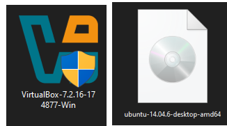
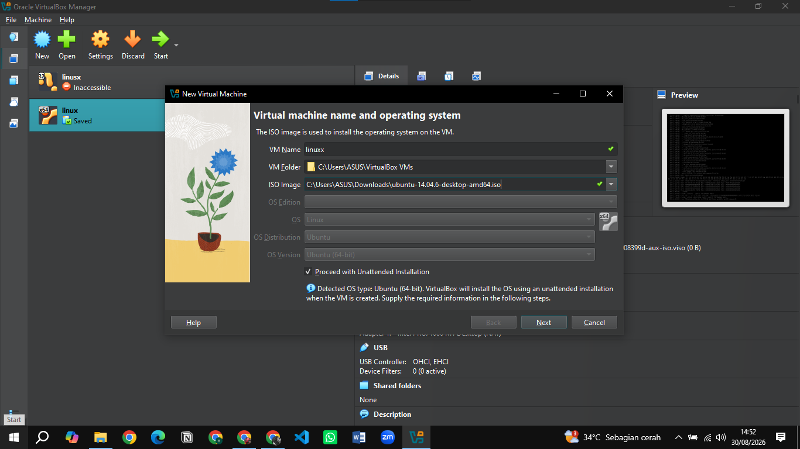
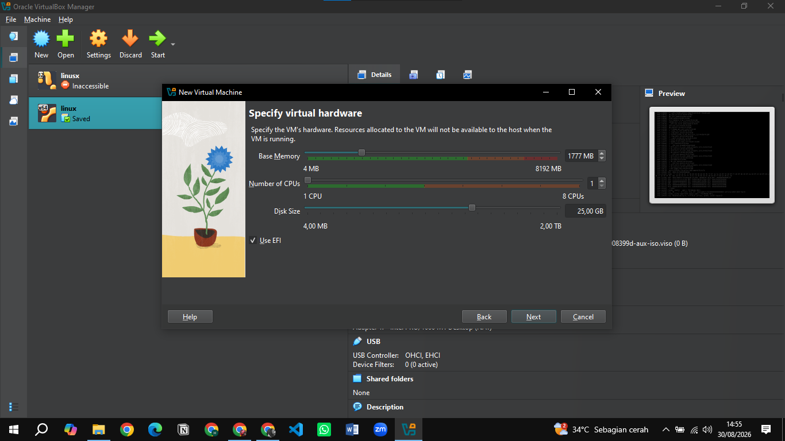
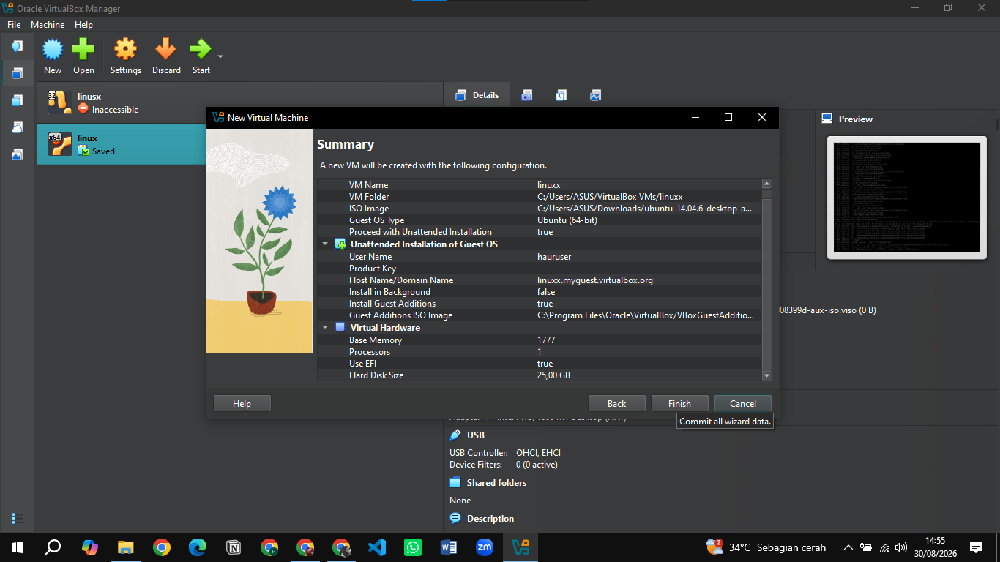
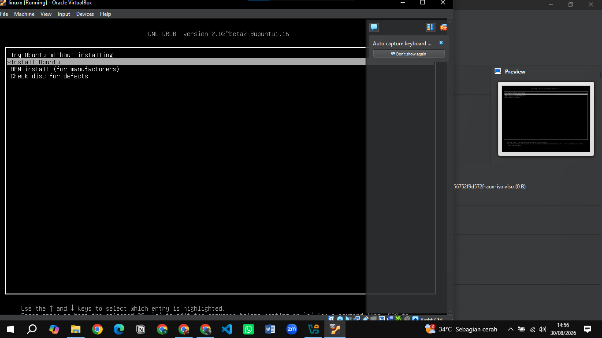
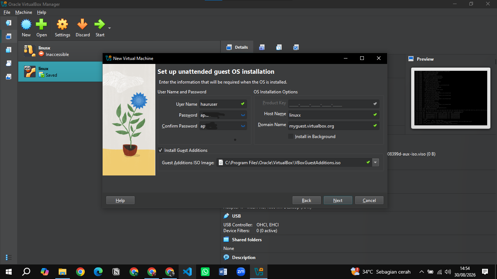

### 1.buatlah laporan proses intallasi dikomputer mahasiswa dan tampilkan screanshot-nya

### 2.analisilah pada gambar kenpa pada saat instalasi perlu dipilih "/" pada opsi Mount Point?
Pemilihan simbol "/" pada opsi Mount Point ditujukan untuk direktori (root). Dalam arsitektur sistem operasi Linux, direktori root (/) adalah hierarki puncak atau akar dari seluruh sistem file.Wajib memilih Mount Point / karena di partisi inilah seluruh pondasi sistem operasi (seperti kernel Linux, program bawaan, dan file konfigurasi) akan diinstal. Jika partisi root / ini tidak ditentukan, instalasi tidak bisa dilanjutkan karena Ubuntu tidak memiliki tempat untuk menyimpan file sistem intinya.  

### 3.Berikan penjelasan tentang ext4,ext3,swap,ntfs,fat32,btrfs?
ext3 (Third Extended Filesystem): Sistem file yang lazim digunakan pada distribusi OS Linux versi lama. ext3 memiliki fitur journaling yang berfungsi melacak perubahan file untuk mencegah kerusakan data ketika komputer mati secara mendadak.  

ext4 (Fourth Extended Filesystem): Sistem file penerus ext3 yang bekerja lebih cepat dan mampu menampung ukuran file serta partisi harddisk yang sangat besar. Pada langkah instalasi di modul, format Ext4 Journal System ini diwajibkan untuk mengatur partisi direktori /home dan direktori root /.   

swap: Area partisi yang dikhususkan sebagai Swap Area atau memori virtual cadangan. Saat memori fisik (RAM) komputer penuh, Linux akan memindahkan data sementara ke partisi ini agar sistem tidak crash. Modul memberikan catatan bahwa pembuatan partisi swap ukurannya harus diatur lebih kecil dibandingkan ukuran harddisk filesystem.   

NTFS (New Technology File System): Sistem file eksklusif buatan Microsoft yang menjadi format standar untuk seluruh sistem operasi Windows modern. NTFS memiliki fitur enkripsi yang baik dan sangat ideal untuk menampung file berukuran lebih dari 4 GB.  

FAT32 (File Allocation Table 32): Sistem file lawas yang paling universal karena formatnya bisa dibaca dan ditulis oleh hampir semua sistem operasi (Windows, Linux, macOS) maupun perangkat lain. Kekurangan utamanya adalah tidak bisa menyimpan satu file yang ukurannya melampaui 4 GB.  

btrfs (B-Tree Filesystem): Sistem file tingkat lanjut untuk Linux yang dirancang khusus dengan fitur perbaikan mandiri (self-healing) dan kemampuan membuat snapshot. Fitur snapshot memungkinkan pengguna untuk mencadangkan (backup) seluruh sistem operasi seketika dan mengembalikannya dengan cepat jika terjadi error.
